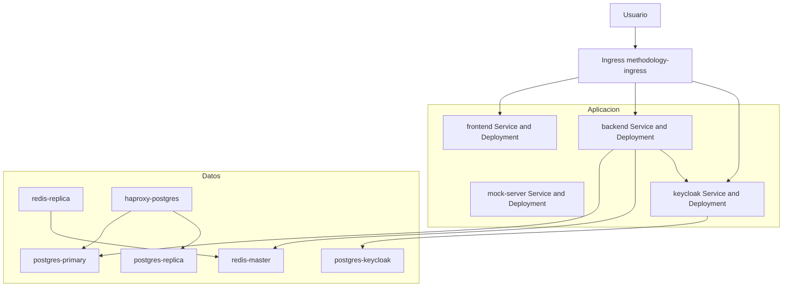
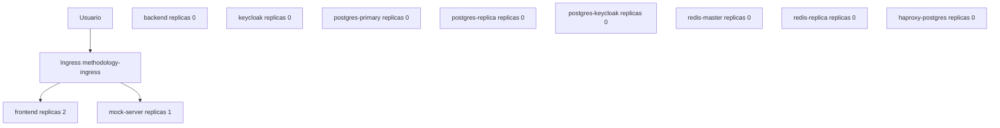
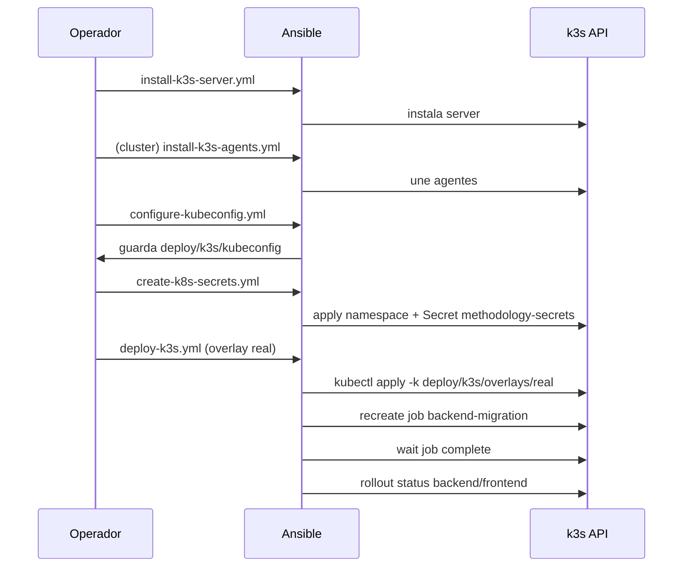

# Arquitectura de Despliegue

## Objetivo

Documentar el despliegue homogeneo del proyecto sobre k3s para:

- una sola maquina (single-node)
- multiples maquinas (cluster server + agents)
- desarrollo local con overlay mock

Todo el despliegue usa Kubernetes Secrets. No se usa Docker Secrets ni `.env` para secretos de despliegue.

## Estructura de despliegue

- `deploy/k3s/base`: manifiestos base comunes
- `deploy/k3s/overlays/real`: overlay de produccion
- `deploy/k3s/overlays/mock`: overlay para frontend + mock
- `ansible/`: instalacion/configuracion de k3s, secretos y despliegue
- `scripts/create-k8s-secret.sh`: creacion rapida de namespace + secret
- `Makefile`: comandos homogeneos de desarrollo y despliegue

Nota: la configuracion de HAProxy ya no se toma de archivo en `haproxy/`. En k3s se define en `deploy/k3s/base/configmap-haproxy.yaml`.

## Componentes desplegados (base)

- `frontend` (Deployment + Service)
- `backend` (Deployment + Service)
- `mock-server` (Deployment + Service, por defecto replicas 0)
- `keycloak` (Deployment + Service)
- `postgres-primary` (Deployment + Service + PVC)
- `postgres-replica` (Deployment + Service + PVC)
- `postgres-keycloak` (Deployment + Service + PVC)
- `redis-master` (Deployment + Service + PVC)
- `redis-replica` (Deployment + Service + PVC)
- `haproxy-postgres` (Deployment + Service)
- `methodology-ingress` (Ingress)
- `backend-migration` (Job, ejecutado en despliegue real)

## Diagrama: arquitectura real (k3s)



## Diagrama: overlay mock



## Diagrama: flujo de despliegue real con Ansible



## Modo real vs mock

- **real (`deploy/k3s/overlays/real`)**: usa todos los componentes base, ejecuta migracion.
- **mock (`deploy/k3s/overlays/mock`)**: backend/keycloak/postgres/redis/haproxy en replicas 0, activa mock-server en replicas 1.

## Secretos

Secret name: `methodology-secrets` en namespace `methodology`.

Claves requeridas:

- `db_primary_password`
- `db_replica_password`
- `db_keycloak_user`
- `db_keycloak_password`
- `master_encryption_key`
- `jwt_secret_key`
- `keycloak_admin_user`
- `keycloak_admin_password`
- `keycloak_client_secret`
- `redis_password`

Se consumen montadas como archivos en `/run/secrets/*`.

## Migraciones

El job `deploy/k3s/base/migration-job.yaml` ejecuta:

- `alembic upgrade head`

Se ejecuta automaticamente en `ansible/playbooks/deploy-k3s.yml` cuando el overlay contiene `real`.

## Operacion minima

Prerequisito para modo manual: las imagenes `methodology-frontend:latest`, `methodology-backend:latest` y `methodology-mock:latest` deben existir en el runtime de k3s (build local + import).

### Despliegue real (manual)

```bash
make k3s-secret-from-env
make k3s-deploy-real
```

### Despliegue mock (manual)

```bash
make k3s-secret-from-env
make k3s-deploy-mock
```

### Estado y limpieza

```bash
make k3s-status
make k3s-delete
```

## Consideraciones de rutas

- Todos los comandos usan rutas relativas desde la raiz del repositorio.
- Los playbooks usan rutas estables (`deploy/k3s/...`) para evitar roturas por ejecucion desde distintos directorios.

## Limpieza de artefactos legacy

- No se mantienen archivos de Docker Swarm/Compose para despliegue.
- No se mantiene archivo `haproxy/haproxy-postgres.cfg` porque el manifiesto k3s usa ConfigMap.
