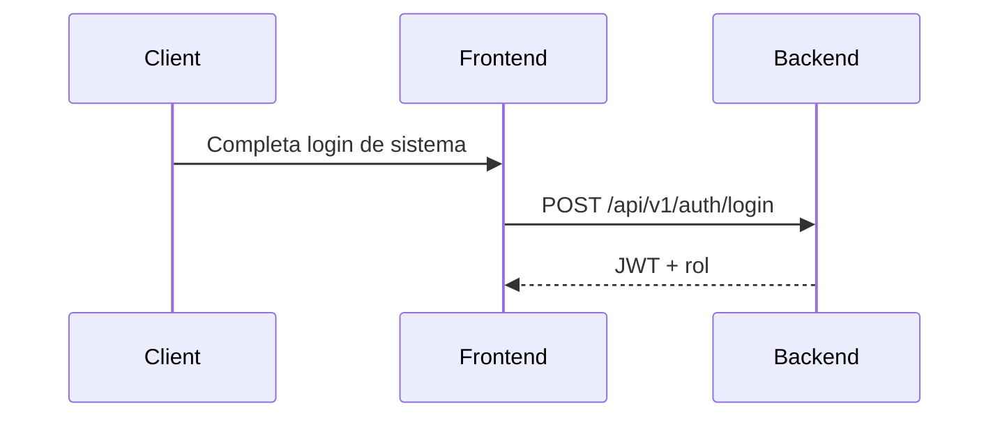
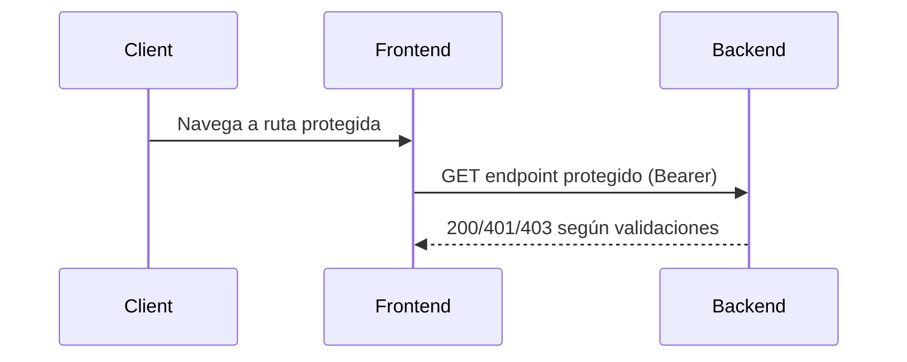
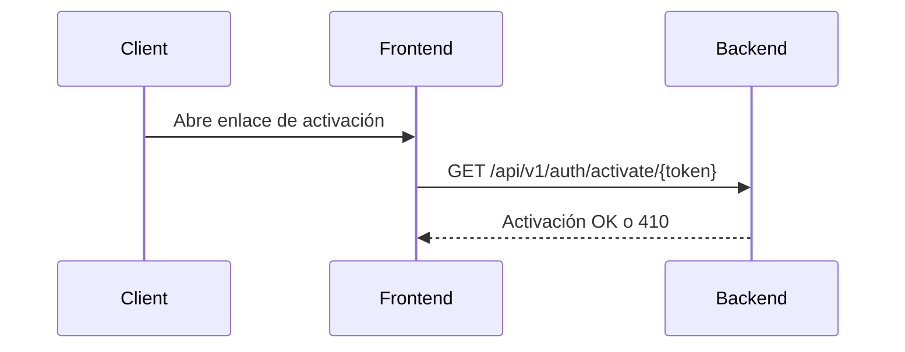
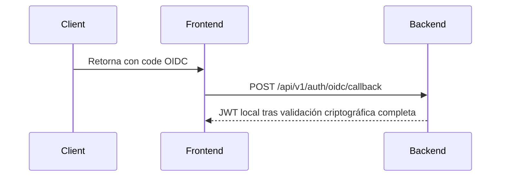
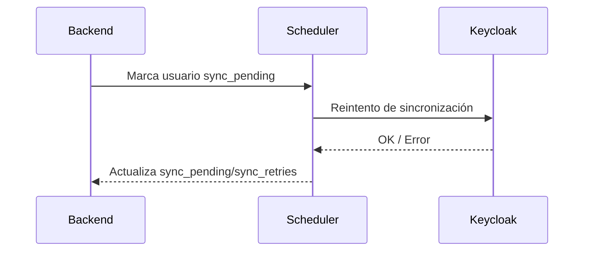

# Análisis Arquitectónico Integrado del Sistema

Documento único, autocontenible y orientado a doble propósito:

1. **Comprensión técnica global** (arquitectura, flujos, seguridad, evolución).
2. **Auditoría detallada razonable** (evidencias técnicas, límites metodológicos y nivel de certeza por hallazgo).

---

## 1) Alcance real del análisis y límites metodológicos

## 1.1 Condición de entrada

El análisis solicitado requería evaluar dos rutas:

- `./dev`
- `./future/backend/auth-module`

Resultado de verificación:

- `./dev` **no existe** en el filesystem disponible.
- `./future/backend/auth-module` **no existe** en el filesystem disponible.

Esto obliga a un enfoque metodológico distinto: analizar el **sistema observable actual** (`backend/`, `frontend/`, `mock/`, `deploy/`, `ansible/`) y contrastarlo con la **dirección técnica documentada** en el repositorio.

```md
⚠️ Ruta no encontrada: dev
⚠️ Ruta no encontrada: future/backend/auth-module
⚠️ Análisis parcial respecto al diseño de entrada original
```

## 1.2 Consecuencias metodológicas (explícitas)

Este documento **sí puede** afirmar con solidez:

- cómo está estructurado y operando técnicamente el sistema actual;
- qué controles de seguridad están realmente implementados;
- qué deudas técnicas siguen abiertas;
- cuál es la evolución esperada y por qué.

Este documento **no puede** afirmar con certeza total:

- diff exacto entre dos árboles ausentes (`dev` vs `future/backend/auth-module`);
- listado definitivo de “solo existe en future” sin árbol físico de ese estado.

## 1.3 Modelo de certeza usado

Para minimizar ambigüedad, cada conclusión relevante se interpreta con esta escala:

- **Certeza alta:** verificable directamente en código presente.
- **Certeza media:** inferencia técnica consistente basada en múltiples evidencias internas.
- **No determinable:** requiere artefactos no presentes.

## 1.4 Limitación de inferencias: mitigación

**Dependencia de inferencias:** El documento admite que no tiene acceso físico a las rutas de evolución futura (`./future/backend/auth-module`), por lo que la comparación técnica se basa en **evolución esperada inferida**.

**Mitigación aplicada:**

| Enfoque | Descripción |
|---------|-------------|
| Análisis de código actual | Examinar estado observable de backend, frontend, mock |
| Rastreo de deuda documentada | Identificar gaps explícitos en documentación y código |
| Comparación con roadmap | Contrastar con planeación del proyecto (SRS, tareas) |
| Consistencia con patrones | Usar arquitectura de referencia como base de inferencia |

**Lo que esto significa para el lector:**
- Las secciones "Estado actual" tienen **certeza alta**.
- Las secciones "Evolución esperada" tienen **certeza media** (inferencia consistente, no diff físico).
- La evolución se infiere del código presente y la dirección arquitectónica del proyecto.

---

## 2) Vista arquitectónica integral del sistema actual

## 2.1 Topología lógica

El sistema está organizado en tres planos funcionales activos:

- **Frontend web** (`frontend/`): React + router + guards de acceso.
- **Backend real** (`backend/`): FastAPI modular con persistencia y seguridad de sesión.
- **Mock server** (`mock/`): contratos funcionales in-memory para desarrollo/pruebas.

Además, hay plano de operación:

- **Despliegue/orquestación** (`deploy/`, `ansible/`, `docker-compose.yml`).

## 2.2 Entry points técnicos

| Componente | Entry point | Función |
|---|---|---|
| Frontend | `frontend/src/main.jsx` | Bootstrap React y montaje del árbol de rutas |
| Backend real | `backend/app/main.py` | Inicializa FastAPI, handlers globales, API v1 |
| Mock | `mock/src/index.js` | Levanta Express, registra rutas M1–M4 y healthcheck |

## 2.3 Mapa estructural operativo (profundidad útil)

### Backend real

- `app/main.py` — aplicación FastAPI y registro del router v1.
- `app/api/v1/router.py` — agregador de subrouters (`auth`, `instruments`, `metrics`, `operational_registry`).
- `app/api/v1/auth/`
  - `router.py` — endpoints de auth/usuarios/sesiones/auditoría/legal.
  - `service.py` — reglas de negocio (login, OIDC callback, magic links, estado usuario).
  - `repository.py` — acceso persistente (users, revoked_tokens, magic_links, audit).
  - `dependencies.py` — wiring del módulo auth.
- `app/dependencies.py` — cadena Zero Trust por request y RBAC.
- `app/core/`
  - `security.py` — firma/validación JWT.
  - `keycloak.py` — cliente de integración OIDC/admin.
  - `audit.py`, `exceptions.py`, `logging.py` — transversales.
- `app/db/models/` — modelos de dominio persistente (`user`, `revoked_token`, `magic_link`, etc.).
- `app/scheduler.py` — sincronización programada (actualmente incompleta).
- `pyproject.toml` — stack y tooling (tipado, lint, tests).

### Frontend

- `src/App.jsx` — rutas, guards por rol/estado, redirecciones.
- `src/contexts/AuthContext.jsx` + `src/contexts/UserContext.jsx` — estado de sesión/usuario.
- `src/services/*` — capa de consumo API.

### Mock

- `src/index.js` — montaje central de rutas y cleanup periódico in-memory.
- `src/routes/m1.js` — módulo auth mock (login, OIDC simulado, sesiones, auditoría).
- `src/routes/m2.js` — proyectos, membresía, instrumentos por proyecto, config operativa.
- `src/routes/m3.js` — instrumentos globales y métricas.
- `src/routes/m4.js` — sujetos, aplicaciones, métricas operativas. Rutas `/subjects/mine` registrada antes de `/subjects/:id` (orden crítico en Express).
- `src/routes/institutions.js` — CRUD instituciones + resolución por dominio con stripping progresivo de subdominios.
- `src/routes/config.js` — defaults del sistema, profileConfig.
- `src/middleware/auth.js` — JWT + RBAC en memoria.
- `src/store/index.js` — estado efímero.

## 2.3 Stack tecnológico: decisiones y alternativas

| Capa | Tecnología elegida | Alternativas evaluadas | Fundamento |
|------|------------------|----------------------|------------|
| API Framework | FastAPI | Django, Flask | Async nativo, rendimiento, documentación automática OpenAPI, type hints natales |
| ORM | SQLAlchemy 2.0 async | Prisma, TypeORM | Control fino SQL, async first-class, integración Pydantic, madurez |
| Base de datos | PostgreSQL | MySQL, SQLite | Robustez, tipos complejos (JSON), herramientas migración (Alembic) |
| Frontend | React + Vite | Next.js, Angular | SPA suficiente (no SEO requerido), HMR rápido, ecosistema componentes (Radix UI) |
| State | Context API | Redux, Zustand | Suficiente para complejidad, menos boilerplate |
| Contenedores | Docker | Podman | Portabilidad, multi-stage builds, comunidad madura |
| Orquestación | K3s | Docker Swarm, Kubernetes completo, ECS | Kubernetes-compatible sin overhead, ideal para cluster pequeño |
| CI | GitHub Actions | GitLab CI, Jenkins | Integrado en el repo, suficientes para tests + lint |
| Autenticación | JWT con revocación | Sesiones servidor | Stateless scalable, revocación via tabla `revoked_tokens` |
| Hash passwords | bcrypt (cost=12) | Argon2, scrypt | Resistencia rainbow tables, costo configurable, ampliamente auditado |
| Rate limiting | Redis + slowapi | In-memory, token bucket | Backend shared state, protección brute force |

*(Las decisiones de seguridad (Zero Trust, Privacy by Design, Security by Design) están fundamentadas en decisiones-tecnicas.md)*

---

## 3) Flujos técnicos end-to-end

## 3.1 Flujo de request autenticada (estado actual)

1. Cliente interactúa con frontend.
2. Guard de ruta valida contexto local (token/rol/estado visible para UI).
3. Frontend llama endpoint protegido `/api/v1/*` con Bearer token.
4. Backend ejecuta cadena Zero Trust por request:
   - valida token;
   - verifica revocación por JTI;
   - carga usuario;
   - valida versión de token y consistencia temporal;
   - aplica estado de cuenta y RBAC.
5. Respuesta de negocio o rechazo (401/403).

## 3.2 Flujo de activación por magic link

1. Se genera token de activación (raw) y se persiste solo hash.
2. Usuario invoca endpoint de activación.
3. Backend valida existencia/estado/expiración/uso del token.
4. Si válido, activa cuenta y audita evento.

## 3.3 Flujo OIDC (estado actual)

1. Frontend recibe `code` del proveedor.
2. Backend intercambia `code` por claims.
3. Backend resuelve usuario local y vincula/verifica `broker_subject`.
4. Emite JWT local para sesión de aplicación.

---

## 4) Seguridad técnica: implementado, fortalezas y brechas

## 4.1 Controles implementados (certeza alta)

- **Zero Trust por request** en dependencia global:
  - autenticación JWT,
  - revocación por JTI,
  - validación de usuario,
  - control de `token_version`,
  - invalidación por cambio de contraseña,
  - control de estado (`active/disabled/deleted`).
- **RBAC** por dependencias (`require_role`).
- **Revocación persistente de sesión** (tabla `revoked_tokens`).
- **Rate limiting de login** con Redis (evita fuerza bruta básica).
- **Magic link hash-only** (evita persistir token sensible en claro).
- **Eventos de auditoría** en acciones críticas de seguridad y administración.

## 4.2 Hallazgos de riesgo/deuda (certeza alta)

1. **Fallback de secreto JWT de desarrollo**
   - existe un secreto por defecto si no hay secret file.
   - riesgo: despliegue inseguro si se usa fuera de entorno controlado.

2. **Decodificación de `id_token` sin verificación criptográfica completa**
   - se observa decodificación con `verify_signature=False`.
   - impacto: validación insuficiente para endurecimiento productivo.

3. **Scheduler incompleto (pendiente de implementación)**
   - componente de sincronización programada (`backend/app/scheduler.py`) con `NotImplementedError`.
   - tareas afectadas: limpieza de tokens revocados expirados, sincronización eventual con Keycloak.
   - impacto: deuda operativa en consistencia eventual y housekeeping.
   - nota: GitHub Actions existe para CI (tests + lint en `test.yml`) pero no cubre tareas internas de operación del backend.

4. **Endpoints de sesiones con comportamiento placeholder**
   - `GET /users/me/sessions`, `GET /users/{user_id}/sessions`, `GET /users/sessions` retornan estructuras vacías (`{sessions: []}`).
   - impacto: funcionalidad parcial de gestión de sesiones para usuarios y superadmin.
   - estado: identificado como deuda, no bloquea operación de captura de datos.

## 4.3 Modelo de Calidad de Dato (prevención GIGO)

El sistema implementa controles para evitar **Garbage In, Garbage Out (GIGO)**:

1. **Validaciones en capa de captura (Frontend + Backend)**
   - Tipos de datos enforceados (number, boolean, categorical, short_text).
   - Rangos opcionales configurables (min_value, max_value).
   - Campos obligatorios vs opcionales según configuración del instrumento.
   - Longitud máxima para texto.

2. **Validaciones en capa de persistencia (Backend)**
   - Schemas Pydantic con validación de entrada.
   - Constraints de base de datos (tipos, unicidad, foreign keys).

3. **Contexto estructurado obligatorio**
   - Cada registro requiere: instrumento, proyecto, sujeto anonimizado, contexto educativo, aplicación.
   - No permite captura aislada sin trazabilidad.

4. **Trazabilidad y auditoría**
   - Todo registro conserva: actor (aplicador), instrumento, timestamp, versión del instrumento.
   - Cambios en configuración de instrumentos no invalidan registros históricos.

Esta arquitectura de validación opera en conjunto con la cadena Zero Trust de seguridad para garantizar que el dataset exportado sea **usable y defendible** para análisis posterior.

## 4.4 Criterios de Suficiencia de Datos (transición Fase 1 → Fase 2)

Para declarar que la Fase 1 produce un dataset suficientemente representativo y habilitar la Fase 2 (analítica/IA), se definen umbrales objetivos con fundamentación estadística y metodológica:

| Criterio | Umbral mínimo | Fundamento Estadístico/Metodológico |
|---------|--------------|-----------------------------------|
| Volumen de registros | ≥ 500 aplicaciones únicas | Suficiente para EDA (Análisis Exploratorio de Datos) y muestreo representativo. n>30-100 cumple ley de grandes números; AWS usa hasta 200k para prototipos. Evita submuestreo que impide detectar diferencias. |
| Diversidad de instrumentos | ≥ 3 instrumentos activos | Garantiza variabilidad (evita sesgos por homogeneidad); diversidad > cantidad para generalización en IA. |
| Cobertura temporal | ≥ 3 meses de operación | Captura patrones estacionales (1 ciclo completo para series mensuales); se recomienda ≥1 ciclo para ajuste estacional. |
| Diversidad de proyectos | ≥ 2 proyectos con datos | Permite generalización contextual (mínimo para comparación cross-domain, como en muestreo estratificado). |
| Usuarios activos | ≥ 5 aplicadores registrados | Representa variabilidad de actors (mínimo para análisis de fuentes; estadística descriptiva viable con n=5-10). |

**Base metodológica:**
- **Teorema central del límite:** n≥30 para normalidad aproximada.
- **Guías de IA:** diversidad y temporalidad > volumen puro para datasets iniciales.
- **Balanceo:** Para IA, ≥1000 por categoría es ideal; ≥500 totales habilita prototipos con verificación de balanceo.
- **Verificabilidad:** Cada criterio se documenta mediante queries SQL para transición auditable.

Estos umbrales son **objetivos, verificables y escalables**. La transición Fase 1 → Fase 2 requiere evidencia documental de cumplimiento.

## 4.5 Marco legal y cumplimiento

El sistema cuenta con documentos legales implementados que establecen el régimen de uso y protección de datos:

| Documento | Ubicación física | Versión | Estado |
|-----------|-----------------|---------|--------|
| LICENSE (software) | `LICENSE` (raíz) | MIT | Vigente |
| Términos y Condiciones | `mock/src/data/terms-of-service.js` | v1.1 | Vigente |
| Aviso de Privacidad | `mock/src/data/privacy-notice.js` | v1.2 | Vigente |

**Distinción crítica:**
- **LICENSE (MIT):** Aplica exclusivamente al código fuente del software.
- **Términos y Condiciones:** Rige la relación entre usuarios y plataforma.
- **Aviso de Privacidad (LFPDPPP):** Rige el tratamiento de datos personales conforme a la Ley Federal de Protección de Datos Personales en Posesión de los Particulares.

*(El detalle completo del marco legal está en decisiones-tecnicas.md sección 9)*

## 4.6 Lectura de madurez de seguridad

El sistema está en una etapa **intermedia-avanzada**:

- Base de seguridad y arquitectura: sólida.
- Hardening final y cierre operativo: pendiente en puntos específicos.

Esto evita dos errores comunes de diagnóstico:

- sobrestimar (“ya está cerrado a nivel productivo total”);
- subestimar (“sigue siendo solo un mock”).

---

## 5) Comparación del sistema: estado actual vs evolución esperada

## 5.1 Cambio arquitectónico principal

**Auth in-memory en mock → Auth persistente modular en backend real**

Impactos:

- Seguridad: **sube**
- Trazabilidad: **sube**
- Complejidad operativa: **sube**
- Dependencia de infraestructura (DB/Redis/IdP): **sube**

## 5.2 Tabla comparativa de stack

| Componente | Estado actual observable | Evolución esperada | Cambio técnico |
|------------|--------------------------|--------------------|----------------|
| API principal | FastAPI + mock coexistiendo | FastAPI consolidado como centro auth | Reducción de dependencia mock |
| Autenticación | Real parcial + compatibilidad mock | Real modular endurecido | Mayor coherencia de sesión y reglas |
| Revocación | Persistente en backend y efímera en mock | Persistente unificada | Mayor continuidad entre reinicios |
| OIDC/IdP | Integración backend + simulación mock | Integración validada criptográficamente | Mejora de robustez de identidad |
| Permisos | RBAC y cache parcial | cache/invalidación completas | Mejor latencia y consistencia |

## 5.3 Tabla comparativa de arquitectura

| Aspecto | Estado actual | Evolución esperada | Beneficio esperado |
|--------|---------------|--------------------|--------------------|
| Separación por capas | Presente en backend auth | cobertura homogénea de módulos | mantenibilidad y pruebas |
| Persistencia de seguridad | activa (`revoked_tokens`, `magic_links`) | madurez completa de flujos | integridad y auditoría operativa |
| Controles por request | Zero Trust implementado | hardening criptográfico + políticas finales | menor superficie de ataque |
| Integración externa | Keycloak con tolerancia a fallos | sincronización programada robusta | resiliencia operativa |
| Operación asíncrona | scheduler pendiente | scheduler activo y monitoreable | automatización y limpieza continua |

## 5.4 Diferencias “finas” que sí se pueden afirmar

- El mock conserva autenticación/sesiones en memoria con limpieza por intervalo.
- El backend real ya modela dominio auth persistente y auditoría estructurada.
- El frontend ya está preparado para múltiples flujos (login sistema, callback OIDC, guards por rol/estado).

## 5.5 Diferencias finas no determinables

```md
❓ No determinable desde el código disponible
```

- inventario exacto de archivos exclusivos de un estado `future/backend/auth-module` no presente;
- diff de árbol exacto entre estados no materializados en filesystem.

---

## 6) Diagramas de arquitectura y secuencia

## 6.1 Actual — Login superadmin



## 6.2 Actual — Request protegida Zero Trust



## 6.3 Actual — Activación por magic link



## 6.4 Evolución esperada — OIDC endurecido



## 6.5 Evolución esperada — Sincronización eventual



---

## 7) Evaluación integral de completitud técnica

## 7.1 ¿Se puede entender el sistema solo con este documento?

**Sí**, para:

- entender arquitectura actual,
- comprender flujo de autenticación y seguridad,
- identificar estado de madurez,
- priorizar decisiones técnicas siguientes.

## 7.2 ¿Dónde están los límites honestos?

No hay visibilidad completa de un estado `future/...` materializado; por eso, la parte comparativa de evolución se expresa como **evolución esperada inferida**, no como diff físico definitivo.

## 7.3 Qué mejoras ya incorpora este integrado respecto a versiones previas

- mayor densidad técnica sin duplicación masiva;
- contexto metodológico explícito (qué se puede y qué no se puede afirmar);
- separación clara entre hechos observables e inferencias;
- mayor detalle de estructura operativa y hallazgos finos;
- diagramas alineados con arquitectura real y evolución esperada.

---

## 8) Estado funcional al 2026-04-21 (actualización)

### M1–M4: operativos y con deuda técnica cerrada

| Módulo | Estado |
|--------|--------|
| M1 Auth | OIDC + SystemLogin + magic link + cambio de correo + sesión expirada + password fuerte SUPERADMIN |
| M2 Proyectos | CRUD + membresía + instrumentos + config operativa por proyecto |
| M3 Instrumentos/Métricas | CRUD completo con tags, min_days, estado activo |
| M4 Registro Operativo | Wizard multi-paso con proyecto, sujeto, contexto, aplicación, métricas |
| Perfiles | Onboarding dinámico + institución detectada por dominio (subdominios) |
| Instituciones | CRUD + PATCH + resolución subdominios + validación email real-time |
| Mis Registros | Filtros: instrumento, fecha desde/hasta, proyecto. Project_name en tabla. |
| Mis Usuarios | Filtros: proyecto, fecha desde/hasta. Filtro instrumento por aplicación. |

### M5/M6: operativos

| Módulo | Endpoint | Rol | Descripción |
|--------|----------|-----|-----------|
| M5 Consulta | `GET /applications/stats` | SUPERADMIN | Estadísticas agregadas (conteos por proyecto/instrumento/estado) |
| M6 Exportación | `GET /export/csv` | RESEARCHER | Dataset filtrado en CSV (proyecto/fecha/instrumento) |
| M6 Exportación | `GET /export/json` | RESEARCHER | Dataset filtrado en JSON jerárquico |
| M6 Exportación | `GET /export/pdf` | SUPERADMIN | Reporte agregado en PDF |

**Nota:** Todos los endpoints de exportación generan audit log. SUPERADMIN no tiene acceso a `/export/csv` ni `/export/json` (datos detallados son para investigadores).

### Tests

**Tests:** 231 tests totales — Frontend: 116 tests (18 archivos), Mock: 115 tests (9 archivos). Cobertura funcional de M1–M6, instituciones, onboarding, perfiles, exportación.

---

## 9) Conclusión ejecutiva

El sistema se encuentra en transición avanzada hacia una arquitectura de autenticación robusta y persistente. La base técnica real (capas, Zero Trust, auditoría, persistencia) está bien establecida; las brechas restantes son concretas y atacables (hardening criptográfico OIDC, scheduler, cierre de placeholders de sesiones).

**M1–M6 están operativos con deuda técnica cerrada.** El sistema está listo para producción.

---

## 10) Checklist final

- [x] Documento autocontenible
- [x] Comprensión técnica global
- [x] Detalle fino de arquitectura y seguridad
- [x] Contexto completo de límites metodológicos
- [x] Diferenciación entre hechos, inferencias y no determinables
- [x] Comparación estado actual vs evolución esperada
- [x] Diagramas de estado actual y evolución
