# Diagramas del Sistema de Captura y Trazabilidad de Datos Académicos (SCTDA)

**Versión:** 1.0
**Fecha:** 2026-04-21
**Propósito:** Documento visual de arquitectura, flujos y secuencias del sistema.

---

## 1) Arquitectura de Alto Nivel

### 1.1 Vista de Componentes

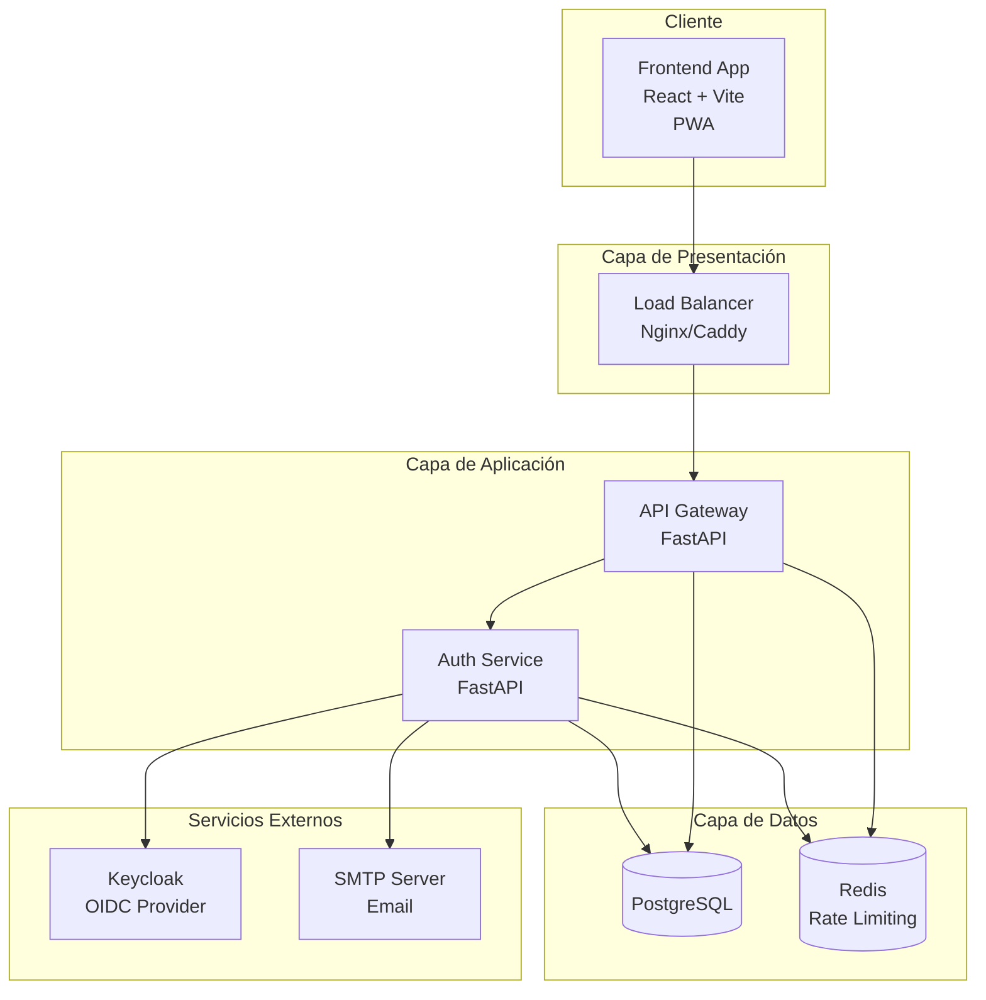
```mermaid
graph TB
    subgraph "Cliente"
        FA[Frontend App<br/>React + Vite<br/>PWA]
    end

    subgraph "Capa de Presentación"
        LB[Load Balancer<br/>Nginx/Caddy]
    end

    subgraph "Capa de Aplicación"
        API[API Gateway<br/>FastAPI]
        AUTH[Auth Service<br/>FastAPI]
    end

    subgraph "Capa de Datos"
        PG[(PostgreSQL)]
        REDIS[(Redis<br/>Rate Limiting)]
    end

    subgraph "Servicios Externos"
        KC[Keycloak<br/>OIDC Provider]
        SMTP[SMTP Server<br/>Email]
    end

    FA --> LB
    LB --> API
    API --> AUTH
    AUTH --> PG
    AUTH --> REDIS
    AUTH --> KC
    API --> PG
    API --> REDIS
    AUTH --> SMTP
```

### 1.2 Topología de Despliegue

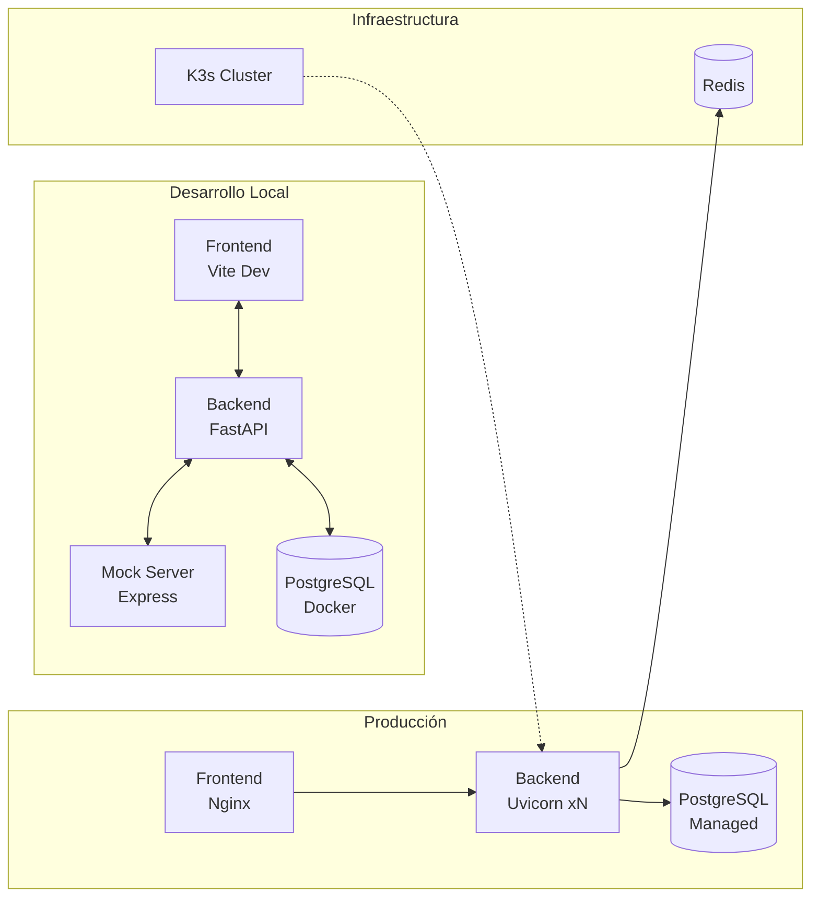
```mermaid
graph LR
    subgraph "Desarrollo Local"
        FE_DEV[Frontend<br/>Vite Dev]
        BE_DEV[Backend<br/>FastAPI]
        MOCK[Mock Server<br/>Express]
        DB_DEV[(PostgreSQL<br/>Docker)]
    end

    subgraph "Producción"
        FE_PROD[Frontend<br/>Nginx]
        BE_PROD[Backend<br/>Uvicorn xN]
        DB_PROD[(PostgreSQL<br/>Managed)]
    end

    subgraph "Infraestructura"
        K3S[K3s Cluster]
        REDIS_PROD[(Redis)]
    end

    FE_DEV <--> BE_DEV
    BE_DEV <--> MOCK
    BE_DEV <--> DB_DEV

    FE_PROD --> BE_PROD
    BE_PROD --> DB_PROD
    BE_PROD --> REDIS_PROD
    K3S -.-> BE_PROD
```

---

## 2) Arquitectura de Componentes

### 2.1 Componentes Principales del Backend

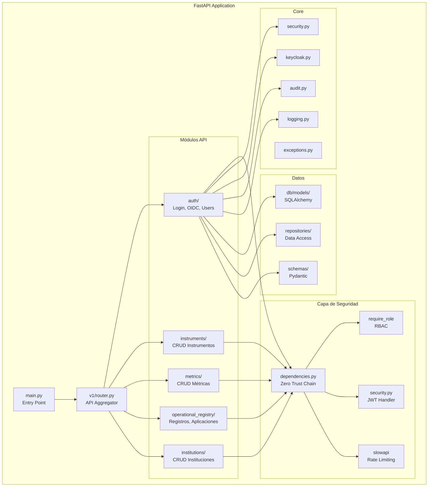
```mermaid
graph TB
    subgraph "FastAPI Application"
        MAIN[main.py<br/>Entry Point]
        ROUTER[v1/router.py<br/>API Aggregator]
        
        subgraph "Módulos API"
            AUTH[auth/<br/>Login, OIDC, Users]
            INST[instruments/<br/>CRUD Instrumentos]
            METR[metrics/<br/>CRUD Métricas]
            REG[operational_registry/<br/>Registros, Aplicaciones]
            INSTIT[institutions/<br/>CRUD Instituciones]
        end

        subgraph "Capa de Seguridad"
            DEP[dependencies.py<br/>Zero Trust Chain]
            RBAC[require_role<br/>RBAC]
            JWT[security.py<br/>JWT Handler]
            RL[slowapi<br/>Rate Limiting]
        end

        subgraph "Core"
            SEC[security.py]
            KC[keycloak.py]
            AUD[audit.py]
            LOG[logging.py]
            EXC[exceptions.py]
        end

        subgraph "Datos"
            MOD[db/models/<br/>SQLAlchemy]
            REP[repositories/<br/>Data Access]
            SCH[schemas/<br/>Pydantic]
        end
    end

    MAIN --> ROUTER
    ROUTER --> AUTH
    ROUTER --> INST
    ROUTER --> METR
    ROUTER --> REG
    ROUTER --> INSTIT

    AUTH --> DEP
    INST --> DEP
    METR --> DEP
    REG --> DEP
    INSTIT --> DEP

    DEP --> RBAC
    DEP --> JWT
    DEP --> RL

    AUTH --> SEC
    AUTH --> KC
    AUTH --> AUD
    AUTH --> LOG

    AUTH --> MOD
    AUTH --> REP
    AUTH --> SCH
```

### 2.2 Estructura de Datos (Modelo Relacional)

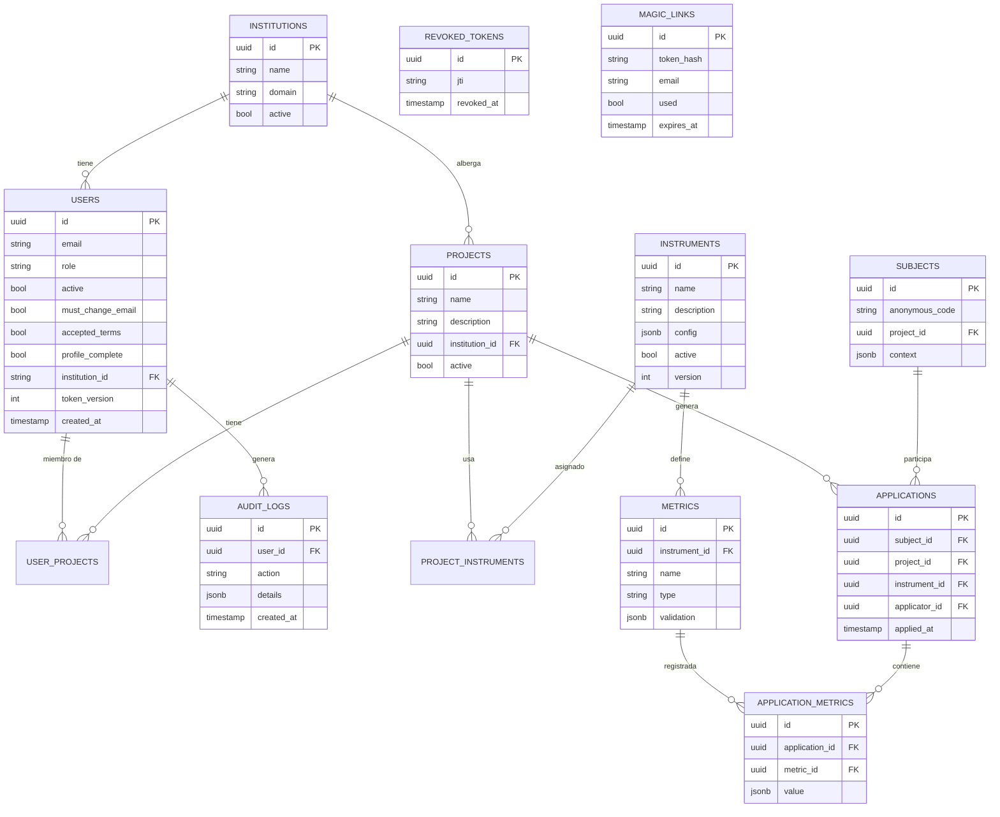
```mermaid
erDiagram
    USERS ||--o{ USER_PROJECTS : "miembro de"
    USERS ||--o{ AUDIT_LOGS : "genera"
    USERS {
        uuid id PK
        string email
        string role
        bool active
        bool must_change_email
        bool accepted_terms
        bool profile_complete
        string institution_id FK
        int token_version
        timestamp created_at
    }

    INSTITUTIONS ||--o{ USERS : "tiene"
    INSTITUTIONS ||--o{ PROJECTS : "alberga"
    INSTITUTIONS {
        uuid id PK
        string name
        string domain
        bool active
    }

    PROJECTS ||--o{ USER_PROJECTS : "tiene"
    PROJECTS ||--o{ PROJECT_INSTRUMENTS : "usa"
    PROJECTS ||--o{ APPLICATIONS : "genera"
    PROJECTS {
        uuid id PK
        string name
        string description
        uuid institution_id FK
        bool active
    }

    INSTRUMENTS ||--o{ PROJECT_INSTRUMENTS : "asignado"
    INSTRUMENTS ||--o{ METRICS : "define"
    INSTRUMENTS {
        uuid id PK
        string name
        string description
        jsonb config
        bool active
        int version
    }

    METRICS ||--o{ APPLICATION_METRICS : "registrada"
    METRICS {
        uuid id PK
        uuid instrument_id FK
        string name
        string type
        jsonb validation
    }

    SUBJECTS ||--o{ APPLICATIONS : "participa"
    SUBJECTS {
        uuid id PK
        string anonymous_code
        uuid project_id FK
        jsonb context
    }

    APPLICATIONS ||--o{ APPLICATION_METRICS : "contiene"
    APPLICATIONS {
        uuid id PK
        uuid subject_id FK
        uuid project_id FK
        uuid instrument_id FK
        uuid applicator_id FK
        timestamp applied_at
    }

    APPLICATION_METRICS {
        uuid id PK
        uuid application_id FK
        uuid metric_id FK
        jsonb value
    }

    REVOKED_TOKENS {
        uuid id PK
        string jti
        timestamp revoked_at
    }

    MAGIC_LINKS {
        uuid id PK
        string token_hash
        string email
        bool used
        timestamp expires_at
    }

    AUDIT_LOGS {
        uuid id PK
        uuid user_id FK
        string action
        jsonb details
        timestamp created_at
    }
```

---

## 3) Diseño de API REST

### 3.1 Endpoints por Módulo

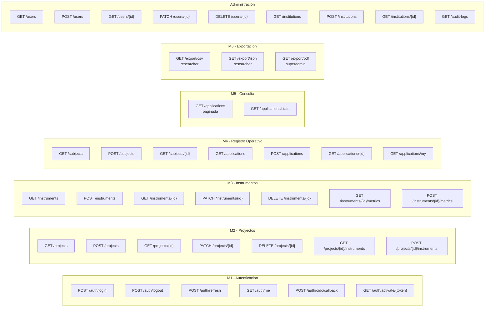
```mermaid
graph LR
    subgraph "M1 - Autenticación"
        M1A[POST /auth/login]
        M1B[POST /auth/logout]
        M1C[POST /auth/refresh]
        M1D[GET /auth/me]
        M1E[POST /auth/oidc/callback]
        M1F["GET /auth/activate/{token}"]
    end

    subgraph "M2 - Proyectos"
        M2A[GET /projects]
        M2B[POST /projects]
        M2C["GET /projects/{id}"]
        M2D["PATCH /projects/{id}"]
        M2E["DELETE /projects/{id}"]
        M2F["GET /projects/{id}/instruments"]
        M2G["POST /projects/{id}/instruments"]
    end

    subgraph "M3 - Instrumentos"
        M3A[GET /instruments]
        M3B[POST /instruments]
        M3C["GET /instruments/{id}"]
        M3D["PATCH /instruments/{id}"]
        M3E["DELETE /instruments/{id}"]
        M3F["GET /instruments/{id}/metrics"]
        M3G["POST /instruments/{id}/metrics"]
    end

    subgraph "M4 - Registro Operativo"
        M4A[GET /subjects]
        M4B[POST /subjects]
        M4C["GET /subjects/{id}"]
        M4D[GET /applications]
        M4E[POST /applications]
        M4F["GET /applications/{id}"]
        M4G[GET /applications/my]
    end

    subgraph "M5 - Consulta"
        M5A[GET /applications<br/>paginada]
        M5B[GET /applications/stats]
    end

    subgraph "M6 - Exportación"
        M6A[GET /export/csv<br/>researcher]
        M6B[GET /export/json<br/>researcher]
        M6C[GET /export/pdf<br/>superadmin]
    end

    subgraph "Administración"
        AD1[GET /users]
        AD2[POST /users]
        AD3["GET /users/{id}"]
        AD4["PATCH /users/{id}"]
        AD5["DELETE /users/{id}"]
        AD6[GET /institutions]
        AD7[POST /institutions]
        AD8["GET /institutions/{id}"]
        AD9["GET /audit-logs"]
    end
```

### 3.2 Contrato de Respuesta API

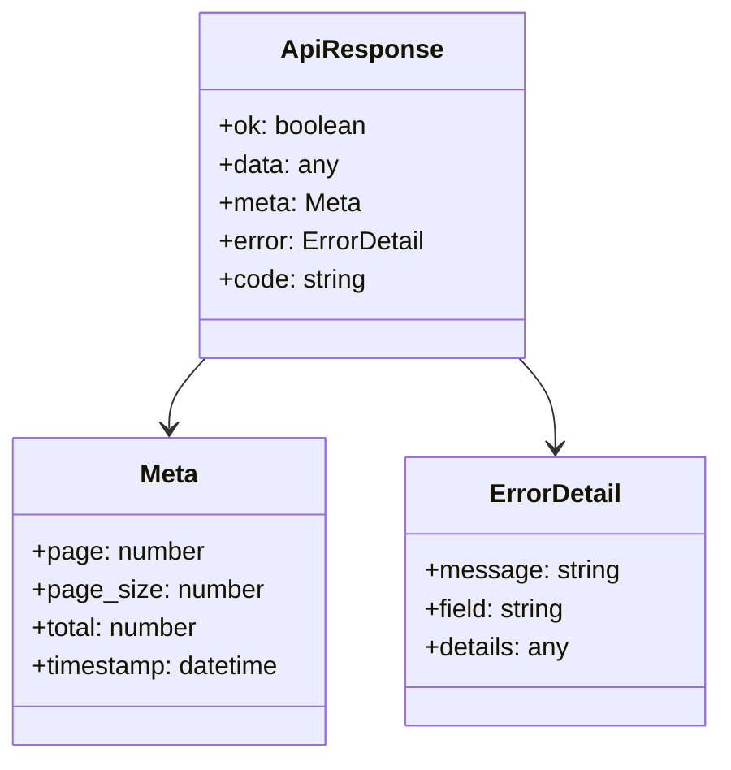
```mermaid
classDiagram
    class ApiResponse {
        +ok: boolean
        +data: any
        +meta: Meta
        +error: ErrorDetail
        +code: string
    }

    class Meta {
        +page: number
        +page_size: number
        +total: number
        +timestamp: datetime
    }

    class ErrorDetail {
        +message: string
        +field: string
        +details: any
    }

    ApiResponse --> Meta
    ApiResponse --> ErrorDetail
```

---

## 4) Flujo de Datos del Sistema

### 4.1 Flujo de Registro de Métricas

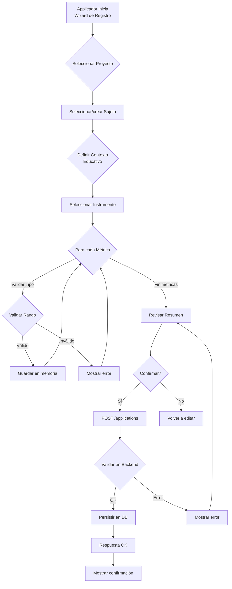
```mermaid
flowchart TD
    A[Applicador inicia<br/>Wizard de Registro] --> B{Seleccionar Proyecto}
    B --> C[Seleccionar/crear Sujeto]
    C --> D{Definir Contexto<br/>Educativo}
    D --> E[Seleccionar Instrumento]
    E --> F{Para cada Métrica}
    F -->|Validar Tipo| G{Validar Rango}
    G -->|Válido| H[Guardar en memoria]
    G -->|Inválido| I[Mostrar error]
    I --> F
    H --> F
    F -->|Fin métricas| J[Revisar Resumen]
    J --> K{Confirmar?}
    K -->|Sí| L[POST /applications]
    K -->|No| M[Volver a editar]
    L --> N{Validar en Backend}
    N -->|OK| O[Persistir en DB]
    N -->|Error| P[Mostrar error]
    P --> J
    O --> Q[Respuesta OK]
    Q --> R[Mostrar confirmación]
```

### 4.2 Flujo de Autenticación (JWT + Zero Trust)

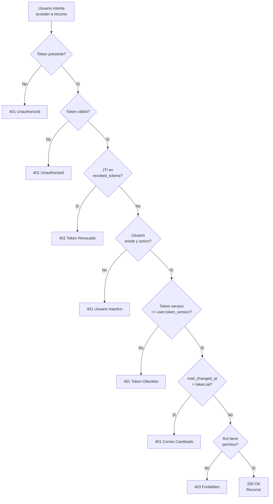
```mermaid
flowchart TD
    A[Usuario intenta<br/>acceder a recurso] --> B{Token presente?}
    B -->|No| C[401 Unauthorized]
    B -->|Sí| D{Token válido?}
    D -->|No| E[401 Unauthorized]
    D -->|Sí| F{JTI en<br/>revoked_tokens?}
    F -->|Sí| G[401 Token Revocado]
    F -->|No| H{Usuario<br/>existe y activo?}
    H -->|No| I[401 Usuario Inactivo]
    H -->|Sí| J{Token version<br/>== user.token_version?}
    J -->|No| K[401 Token Obsoleto]
    J -->|Sí| L{mail_changed_at<br/>> token.iat?}
    L -->|Sí| M[401 Correo Cambiado]
    L -->|No| N{Rol tiene<br/>permiso?}
    N -->|No| O[403 Forbidden]
    N -->|Sí| P[200 OK<br/>Recurso]
```

---

## 5) Diagramas de Secuencia

### 5.1 Secuencia: Login de Superadmin

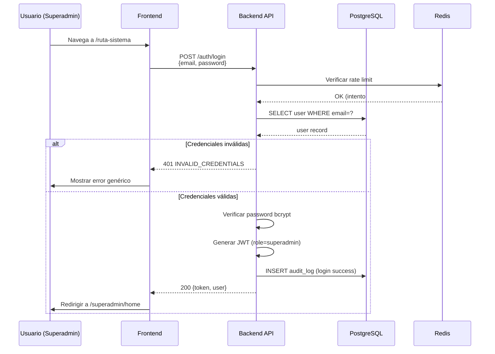
```mermaid
sequenceDiagram
    participant U as Usuario (Superadmin)
    participant FE as Frontend
    participant API as Backend API
    participant DB as PostgreSQL
    participant RL as Redis

    U->>FE: Navega a /ruta-sistema
    FE->>API: POST /auth/login<br/>{email, password}
    API->>RL: Verificar rate limit
    RL-->>API: OK (intento #3)
    API->>DB: SELECT user WHERE email=?
    DB-->>API: user record
    
    alt Credenciales inválidas
        API-->>FE: 401 INVALID_CREDENTIALS
        FE->>U: Mostrar error genérico
    else Credenciales válidas
        API->>API: Verificar password bcrypt
        API->>API: Generar JWT (role=superadmin)
        API->>DB: INSERT audit_log (login success)
        API-->>FE: 200 {token, user}
        FE->>U: Redirigir a /superadmin/home
    end
```

### 5.2 Secuencia: Activación por Magic Link

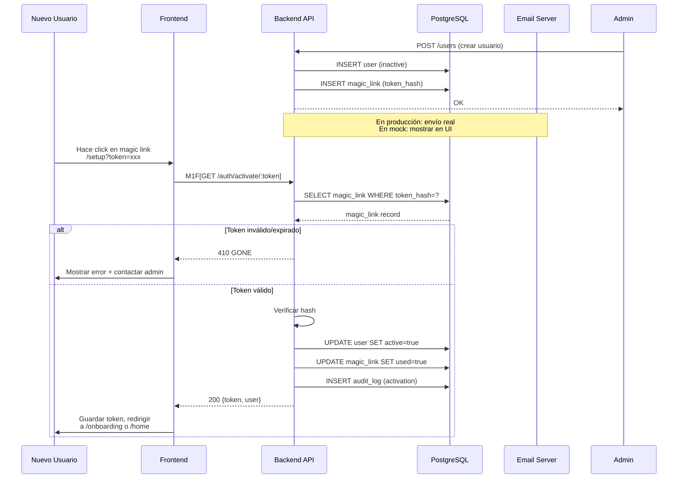
```mermaid
sequenceDiagram
    participant U as Nuevo Usuario
    participant FE as Frontend
    participant API as Backend API
    participant DB as PostgreSQL
    participant SMTP as Email Server

    Admin->>API: POST /users (crear usuario)
    API->>DB: INSERT user (inactive)
    API->>DB: INSERT magic_link (token_hash)
    API-->>Admin: OK
    
    Note over API,SMTP: En producción: envío real<br/>En mock: mostrar en UI

    U->>FE: Hace click en magic link<br/>/setup?token=xxx
    FE->>API: M1F[GET /auth/activate/:token]
    
    API->>DB: SELECT magic_link WHERE token_hash=?
    DB-->>API: magic_link record
    
    alt Token inválido/expirado
        API-->>FE: 410 GONE
        FE->>U: Mostrar error + contactar admin
    else Token válido
        API->>API: Verificar hash
        API->>DB: UPDATE user SET active=true
        API->>DB: UPDATE magic_link SET used=true
        API->>DB: INSERT audit_log (activation)
        API-->>FE: 200 {token, user}
        FE->>U: Guardar token, redirigir<br/>a /onboarding o /home
    end
```

### 5.3 Secuencia: OIDC Callback

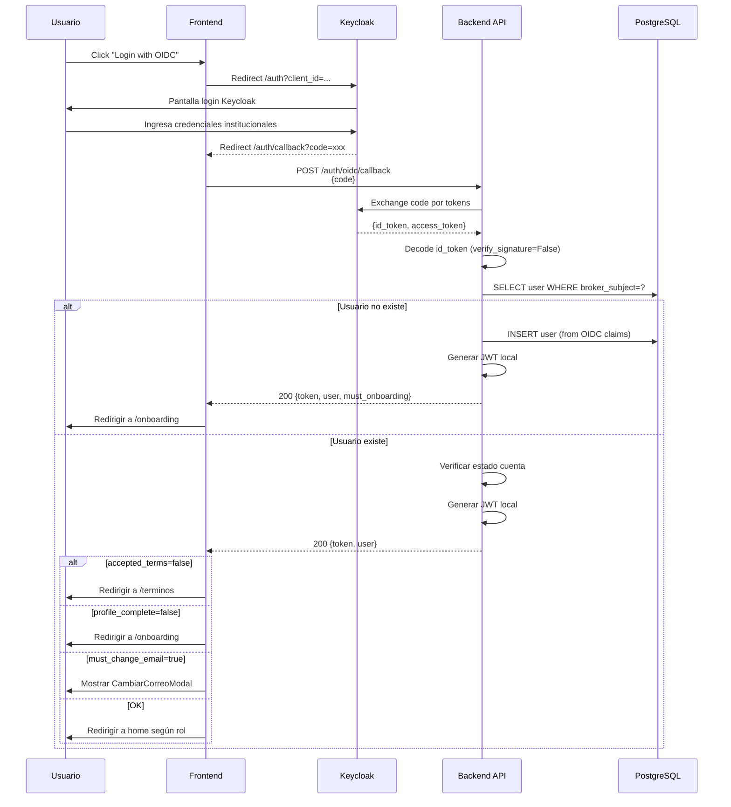
```mermaid
sequenceDiagram
    participant U as Usuario
    participant FE as Frontend
    participant KC as Keycloak
    participant API as Backend API
    participant DB as PostgreSQL

    U->>FE: Click "Login with OIDC"
    FE->>KC: Redirect /auth?client_id=...
    KC->>U: Pantalla login Keycloak
    U->>KC: Ingresa credenciales institucionales
    KC-->>FE: Redirect /auth/callback?code=xxx
    
    FE->>API: POST /auth/oidc/callback<br/>{code}
    
    API->>KC: Exchange code por tokens
    KC-->>API: {id_token, access_token}
    
    API->>API: Decode id_token (verify_signature=False)
    API->>DB: SELECT user WHERE broker_subject=?
    
    alt Usuario no existe
        API->>DB: INSERT user (from OIDC claims)
        API->>API: Generar JWT local
        API-->>FE: 200 {token, user, must_onboarding}
        FE->>U: Redirigir a /onboarding
    else Usuario existe
        API->>API: Verificar estado cuenta
        API->>API: Generar JWT local
        API-->>FE: 200 {token, user}
        
        alt accepted_terms=false
            FE->>U: Redirigir a /terminos
        else profile_complete=false
            FE->>U: Redirigir a /onboarding
        else must_change_email=true
            FE->>U: Mostrar CambiarCorreoModal
        else OK
            FE->>U: Redirigir a home según rol
        end
    end
```

### 5.4 Secuencia: Registro de Aplicación (Wizard)

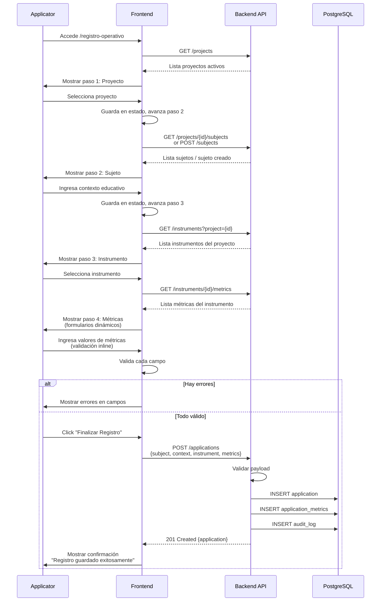
```mermaid
sequenceDiagram
    participant A as Applicator
    participant FE as Frontend
    participant API as Backend API
    participant DB as PostgreSQL

    A->>FE: Accede /registro-operativo
    FE->>API: GET /projects
    API-->>FE: Lista proyectos activos
    FE->>A: Mostrar paso 1: Proyecto

    A->>FE: Selecciona proyecto
    FE->>FE: Guarda en estado, avanza paso 2
    
    FE->>API: GET /projects/{id}/subjects<br/>or POST /subjects
    API-->>FE: Lista sujetos / sujeto creado
    FE->>A: Mostrar paso 2: Sujeto

    A->>FE: Ingresa contexto educativo
    FE->>FE: Guarda en estado, avanza paso 3
    
    FE->>API: GET /instruments?project={id}
    API-->>FE: Lista instrumentos del proyecto
    FE->>A: Mostrar paso 3: Instrumento

    A->>FE: Selecciona instrumento
    FE->>API: GET /instruments/{id}/metrics
    API-->>FE: Lista métricas del instrumento
    FE->>A: Mostrar paso 4: Métricas<br/>(formularios dinámicos)

    A->>FE: Ingresa valores de métricas<br/>(validación inline)
    FE->>FE: Valida cada campo
    
    alt Hay errores
        FE->>A: Mostrar errores en campos
    else Todo válido
        A->>FE: Click "Finalizar Registro"
        FE->>API: POST /applications<br/>{subject, context, instrument, metrics}
        
        API->>API: Validar payload
        API->>DB: INSERT application
        API->>DB: INSERT application_metrics
        API->>DB: INSERT audit_log
        
        API-->>FE: 201 Created {application}
        FE->>A: Mostrar confirmación<br/>"Registro guardado exitosamente"
    end
```

### 5.5 Secuencia: Exportación de Datos

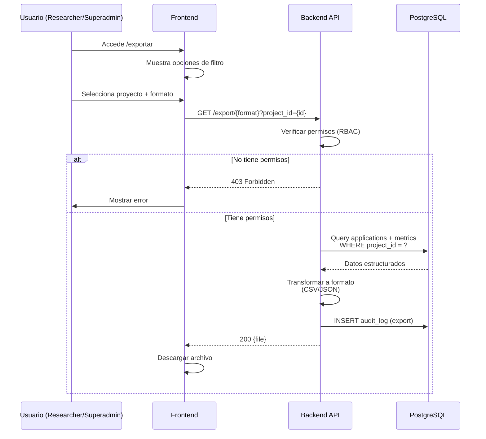
```mermaid
sequenceDiagram
    participant U as Usuario (Researcher/Superadmin)
    participant FE as Frontend
    participant API as Backend API
    participant DB as PostgreSQL

    U->>FE: Accede /exportar
    FE->>FE: Muestra opciones de filtro
    
    U->>FE: Selecciona proyecto + formato
    FE->>API: GET /export/{format}?project_id={id}
    
    API->>API: Verificar permisos (RBAC)
    
    alt No tiene permisos
        API-->>FE: 403 Forbidden
        FE->>U: Mostrar error
    else Tiene permisos
        API->>DB: Query applications + metrics<br/>WHERE project_id = ?
        DB-->>API: Datos estructurados
        
        API->>API: Transformar a formato<br/>(CSV/JSON)
        API->>DB: INSERT audit_log (export)
        
        API-->>FE: 200 {file}
        FE->>FE: Descargar archivo
    end
```

### 5.6 Secuencia: Consulta de Registros (Investigador)

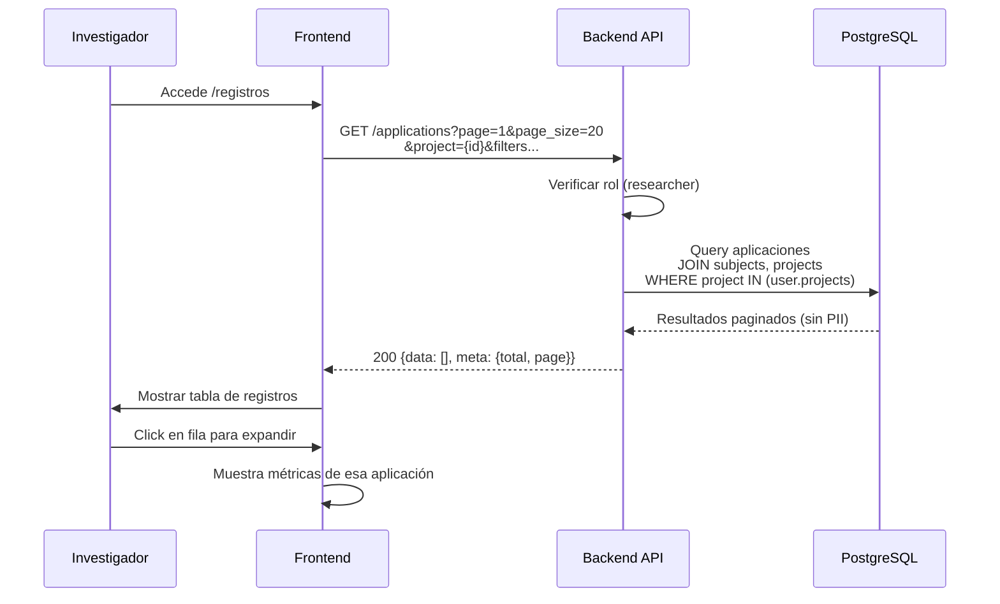
```mermaid
sequenceDiagram
    participant U as Investigador
    participant FE as Frontend
    participant API as Backend API
    participant DB as PostgreSQL

    U->>FE: Accede /registros
    FE->>API: GET /applications?page=1&page_size=20<br/>&project={id}&filters...
    
    API->>API: Verificar rol (researcher)
    API->>DB: Query aplicaciones<br/>JOIN subjects, projects<br/>WHERE project IN (user.projects)
    DB-->>API: Resultados paginados (sin PII)
    
    API-->>FE: 200 {data: [], meta: {total, page}}
    FE->>U: Mostrar tabla de registros

    U->>FE: Click en fila para expandir
    FE->>FE: Muestra métricas de esa aplicación
```

---

## 6) Flujo de Datos Entre Componentes

### 6.1 Flujo Completo de una Solicitud

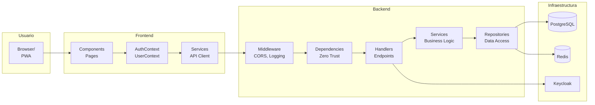
```mermaid
flowchart LR
    subgraph "Usuario"
        BR[Browser/<br/>PWA]
    end

    subgraph "Frontend"
        CTX[AuthContext<br/>UserContext]
        SVC[Services<br/>API Client]
        UI[Components<br/>Pages]
    end

    subgraph "Backend"
        MID[Middleware<br/>CORS, Logging]
        DEP[Dependencies<br/>Zero Trust]
        HD[Handlers<br/>Endpoints]
        SVC_B[Services<br/>Business Logic]
        REP[Repositories<br/>Data Access]
    end

    subgraph "Infraestructura"
        DB[(PostgreSQL)]
        RC[(Redis)]
        KC[Keycloak]
    end

    BR --> UI
    UI --> CTX
    CTX --> SVC
    SVC --> MID
    MID --> DEP
    DEP --> HD
    HD --> SVC_B
    SVC_B --> REP
    REP --> DB
    REP --> RC
    HD --> KC
```

---

## 7) Máquinas de Estado

### 7.1 Estado del Usuario

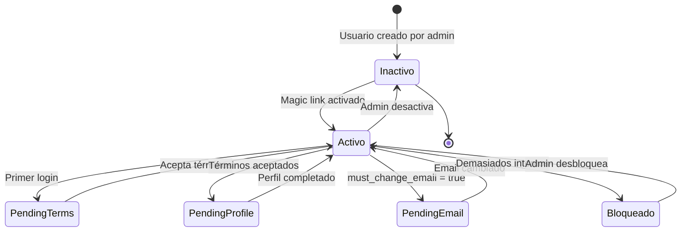
```mermaid
stateDiagram-v2
    [*] --> Inactivo: Usuario creado por admin
    
    Inactivo --> Activo: Magic link activado
    Activo --> Inactivo: Admin desactiva
    Inactivo --> [*]
    
    Activo --> PendingTerms: Primer login
    PendingTerms --> Activo: Acepta términos
    
    Activo --> PendingProfile: Términos aceptados
    PendingProfile --> Activo: Perfil completado
    
    Activo --> PendingEmail: must_change_email = true
    PendingEmail --> Activo: Email cambiado
    
    Activo --> Bloqueado: Demasiados intentos
    Bloqueado --> Activo: Admin desbloquea
```

### 7.2 Estado del Magic Link

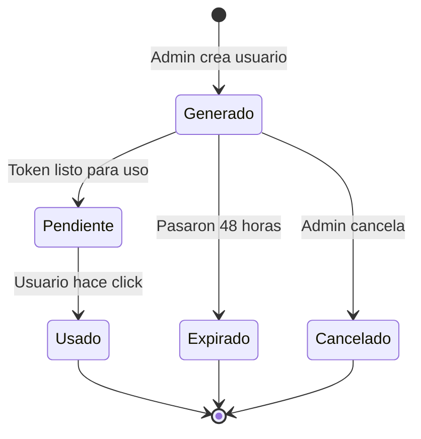
```mermaid
stateDiagram-v2
    [*] --> Generado: Admin crea usuario
    
    Generado --> Pendiente: Token listo para uso
    Pendiente --> Usado: Usuario hace click
    Usado --> [*]
    
    Generado --> Expirado: Pasaron 48 horas
    Expirado --> [*]
    
    Generado --> Cancelado: Admin cancela
    Cancelado --> [*]
```

### 7.3 Estado del Registro Operativo

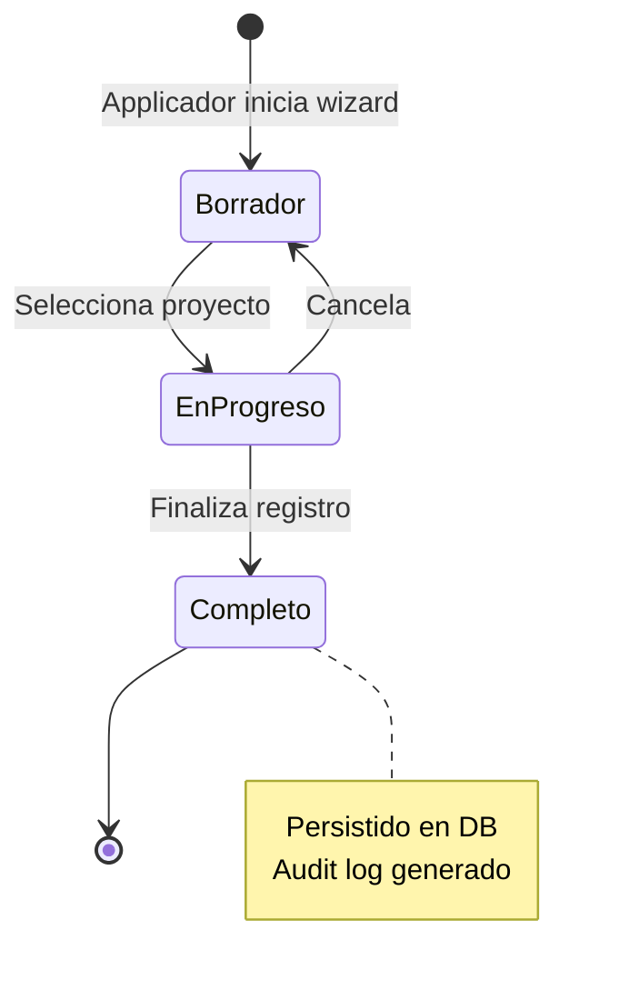
```mermaid
stateDiagram-v2
    [*] --> Borrador: Applicador inicia wizard
    
    Borrador --> EnProgreso: Selecciona proyecto
    EnProgreso --> Borrador: Cancela
    
    EnProgreso --> Completo: Finaliza registro
    Completo --> [*]
    
    note right of Completo
        Persistido en DB
        Audit log generado
    end note
```

---

## 8) Resumen de Flujos

### 8.1 Resumen Visual

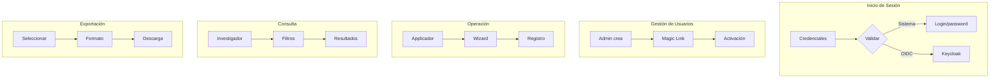
```mermaid
graph TD
    subgraph "Inicio de Sesión"
        S1[Credenciales] --> S2{Validar}
        S2 -->|Sistema| S3[Login/password]
        S2 -->|OIDC| S4[Keycloak]
    end

    subgraph "Gestión de Usuarios"
        S5[Admin crea] --> S6[Magic Link]
        S6 --> S7[Activación]
    end

    subgraph "Operación"
        S8[Applicador] --> S9[Wizard]
        S9 --> S10[Registro]
    end

    subgraph "Consulta"
        S11[Investigador] --> S12[Filtros]
        S12 --> S13[Resultados]
    end

    subgraph "Exportación"
        S14[Seleccionar] --> S15[Formato]
        S15 --> S16[Descarga]
    end
```

---

## 9) Referencias

- **Arquitectura detallada:** `arquitectura.md`
- **Decisiones técnicas:** `decisiones-tecnicas.md`
- **Flujo del sistema:** `FLUJO_SISTEMA_FINAL.md`
- **FICHA técnica:** `ficha-tecnica.md`
